# MARP Themes - `marpstyle`

Marp themes repository, created with beauty and simplicity as first concerns.<br>
Last update: 20.jun.2023


# Whas new?

Just arrived! The Kurt Gödel theme! Still under final ajustments but already functional. Enjoy!


| 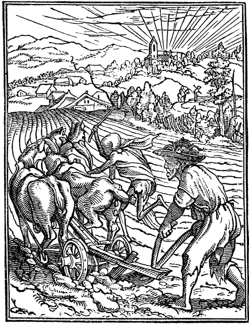 | This set of styles (themes) were designed bearing mainly simplicity and beauty in mind as first class requirements. As the first theme (plato.css) got ready I decided to share. I hope sincerely you enjoy it and it comes to be useful to as many users as possible. More styles are due to come in a fashionable time. <br> <br> 🔥🎀 Stay tuned for more Marpstyle Themes! 🔥🎀 |
| --------------------- | :------------------------------------------------------------------------------------------------------------------------------------------------------------------------------------------------------------------------------------------------------------------------------------------------------------ |

## What is Marp?

- As you will find better explained in [Marp´s site at Github](https://github.com/marp-team/marp), Marpit /mɑːrpɪt/ is the skinny framework for creating slide deck from Markdown,  created by [Yuki Hattori](https://github.com/yhatt), to whom I am very thankful.

- All the themes here presented are destinated to be used with the [Marpit: Markdown slide deck framework](https://marpit.marp.app/markdown). In order to install Marp in your VS Code, take a look at [Marp for VS Code](https://marketplace.visualstudio.com/items?itemName=marp-team.marp-vscode).

## Available Themes

 Here you´ll find examples of the available themes. Click on the picture to open a corresponding PDF example.

- ### SOCRATES theme in honor of Σωκράτης (469–399 B.C.E.)
  [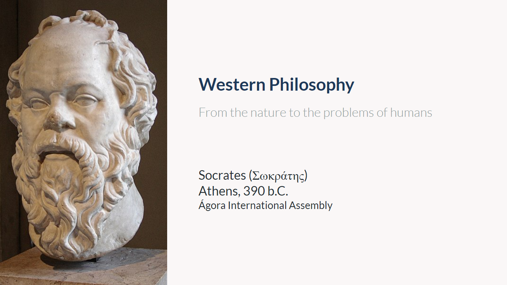](examples/example-socrates.pdf)


- ### PLATO theme in honor of Πλάτων (429?–347 B.C.E.)
  [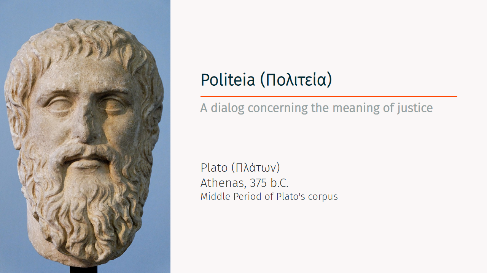](examples/example-plato.pdf)

- ### DESCARTES theme in honor of René Descartes (1596–1650) 
  [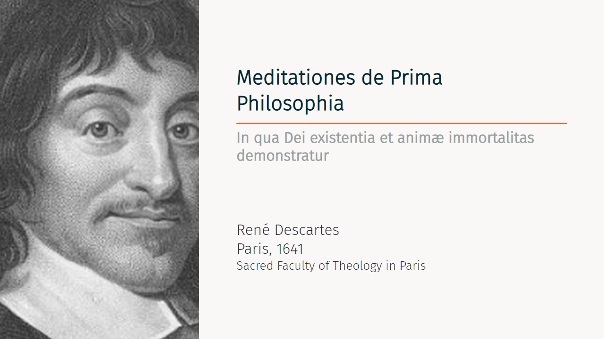](examples/example-descartes.pdf)

- ### LEIBNIZ theme in honor of Gottfried Wilhelm Leibniz (1646–1716) 
  [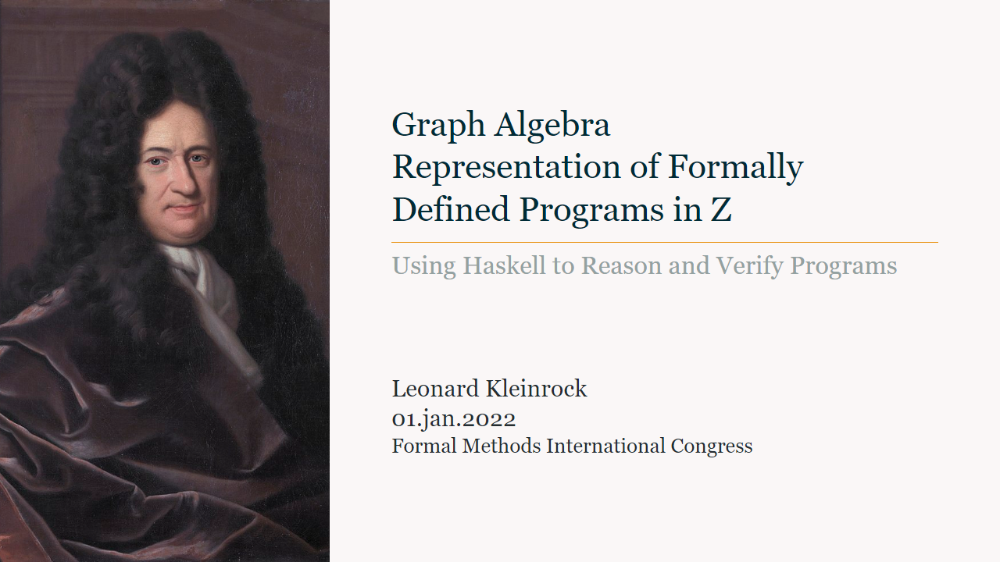](examples/example-leibniz.pdf)

- ### KANT theme in honor of Immanuel Kant (1724–1804)
  [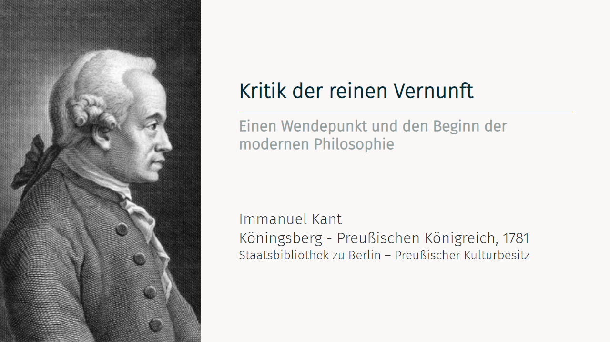](examples/example-kant.pdf)

- ### HEGEL theme in honor of Georg Wilhelm Friedrich Hegel (1770–1831)
  [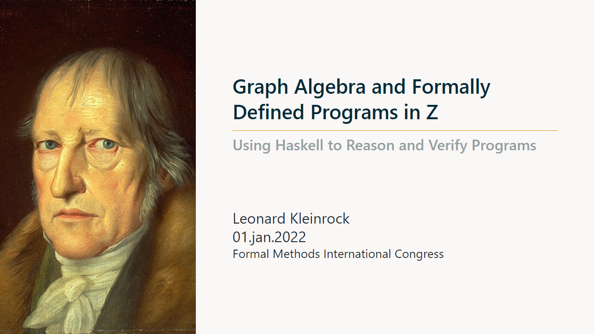](examples/example-hegel.pdf)

- ### FREUD theme in honor of Sigmund Freud (Sigismund Schlomo Freud) (1856-1939)
  [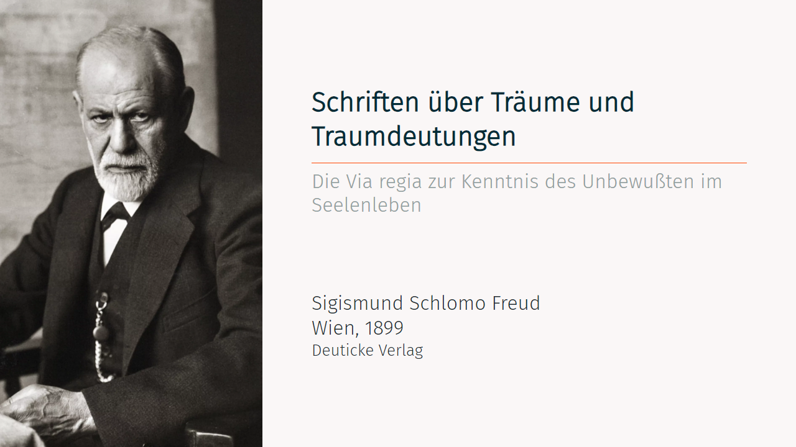](examples/example-freud.pdf)

- ### HUSSERL theme in honor of Edmund Husserl (1859–1938) 
  [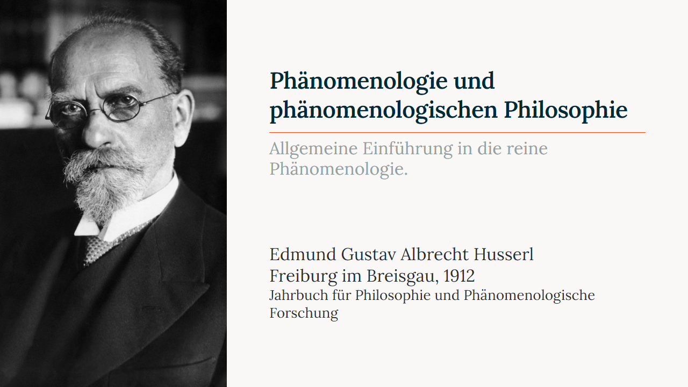](examples/example-husserl.pdf)

- ### GÖDEL theme in honor of Kurt Gödel (1859–1938) 
  [](examples/example-godel.pdf)

- ### HEIDEGGER theme in honor of Martin Heidegger (1889–1976) 
  [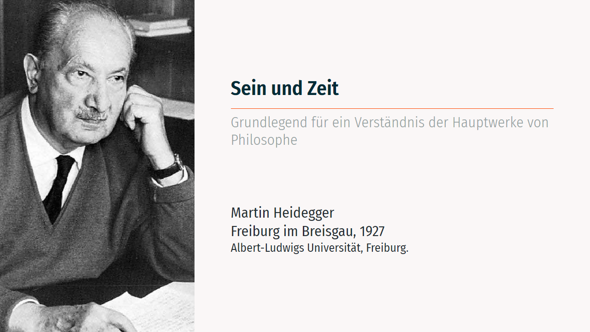](examples/example-heidegger.pdf)

- ### JOBS theme in honor of Steven Paul Jobs (1955–2011) 
  [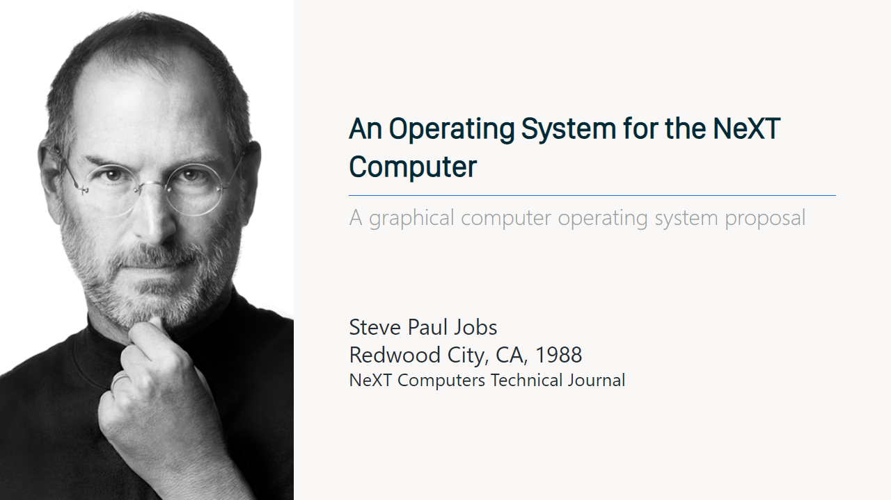](examples/example-jobs.pdf)

<br>

# Install

As a MARP´s prerequisite, remember to include the path to the theme files (CSS files) in your `workspace.code-workspace` in order to make them available to your slide deck.

## It might look similar to:

<br>

```json
{
	"folders": [
		{
			"path": "."
		}
	],
	"settings": {
		"markdown.marp.themes": [
			"./style/socrates.css"
			"./style/plato.css"
			"./style/descartes.css"
			"./style/leibniz.css"
			"./style/kant.css"
			"./style/hegel.css"
			"./style/freud.css"
			"./style/husserl.css"
			"./style/godel.css"
			"./style/heidegger.css"
			"./style/jobs.css"
			"./style/schema.css"
			"./style/structure.css"
		]
	}
}
```

## You might as well use my themes directly from github using the url, just like depicted below:

```json
{
	"folders": [
		{
			"path": "."
		}
	],
	"settings": {
		"markdown.marp.themes": [
			"https://cunhapaulo.github.io/style/descartes.css"
			"https://cunhapaulo.github.io/style/freud.css"
			"https://cunhapaulo.github.io/style/godel.css"
			"https://cunhapaulo.github.io/style/hegel.css"
			"https://cunhapaulo.github.io/style/heidegger.css"
			"https://cunhapaulo.github.io/style/husserl.css"
			"https://cunhapaulo.github.io/style/kant.css"
			"https://cunhapaulo.github.io/style/leibniz.css"
			"https://cunhapaulo.github.io/style/orwell.css"
			"https://cunhapaulo.github.io/style/plato.css"
			"https://cunhapaulo.github.io/style/schema.css"
			"https://cunhapaulo.github.io/style/simple.css"
			"https://cunhapaulo.github.io/style/socrates.css"
			"https://cunhapaulo.github.io/style/structure.css"
		]
	}
}
```

<br>

# Typefaces

Some of the fonts necessary to the available styles are listed below with its respective link for download:

- ## Socrates Theme:
  
  - Noto Sans: https://fonts.google.com/noto/specimen/Noto+Sans

- ## Plato Theme:
  
  - Fira Sans Light: https://fonts.google.com/specimen/Fira+Sans?query=fira
  - Fira Sans Light: https://github.com/bBoxType/FiraSans

- ## Leibniz Theme:
  
  - Georgia or Serif: 

- ## Husserl Theme:

  <!-- - Montserrat: https://fonts.google.com/specimen/Montserrat?query=Mont -->
  - Lora: https://fonts.google.com/specimen/Lora?query=Lora
  - Fira Sans Light: https://fonts.google.com/specimen/Fira+Sans?query=fira

- ## General
  
  - Metropolis: https://github.com/njugunagathere/Metropolis


# Credits

- **Plato** theme was inspired by [Metropolis Beamer Theme](https://github.com/matze/mtheme) for LaTeX by [Mathias Vogelgesang](https://github.com/matze/mtheme). Vielen Dank!!
- Used some parts of [Juan Vera del Campo](https://github.com/Juanvvc) CSS styles. Gracias!
