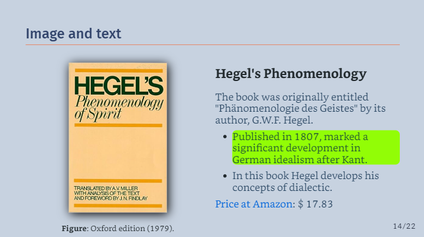
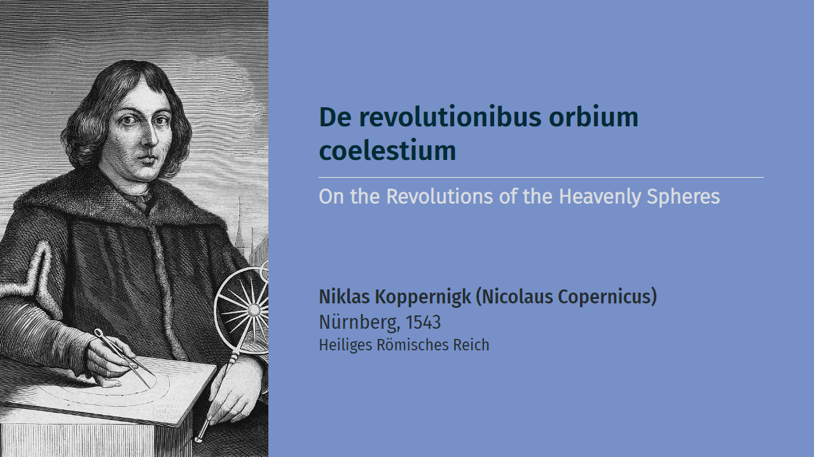
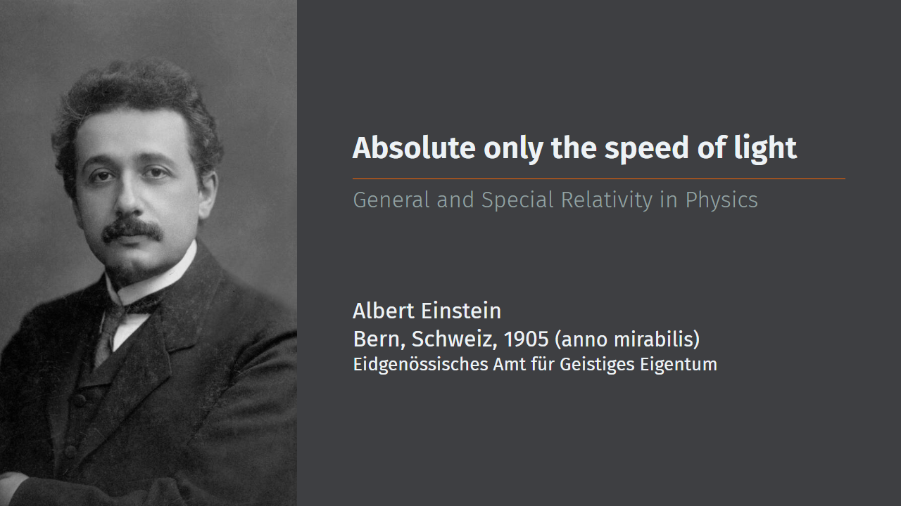

# `Marpstyle`: styles for the MARP package

`marpstyle` was created with beauty and simplicity as its main concerns, while taking functionality into account. Back in 2021, when the first plato.css theme was ready, I decided to share it freely here on Github.
I sincerely hope you make good use of it and that it comes to be as useful to you as it has been to me. 

### if you find the styles useful, please include the credits in your presentations!

##  **New Feature**:  List Items Highlight (18.03.2024)

I have just implemented the highlighting of list elements in all styles when you move the mouse pointer over them. 

> Please note that this function, like many others, only works if you export your presentation in HTML mode.



> If you do not like the highlighting or the default color, you can either deactivate it or change the color of the highlighting bar as follows:


### To disable list item highlight:

Insert the following the code in the begining of your presentation code:

```css

<style>

li:hover {
	background-color: inherit;
}

</style>

```

### To change the highlighting color:

Insert the following the code in the begining of your presentation code:

```css

<style>

li:hover {
  background-color: rgb(46, 253, 6); 
}

</style>

```
----

## (**FORTHCOMING** - soon!)
- Hume
- Orwell
- Pascal

These styles will soon be released!  Stay tuned for more `marpstyle themes`! 

## One Example of Marp slide creation with style!

This slide deck was created for a presentarion about Artifical Inteligence (AI). It show some of the capabilities of MARP as well my CSS styles. I hope you like it.

 Academic presentation on philosophical aspects of Artificial Intelligence (AI):

[](https://cunhapaulo.github.io/ai/)
- [Link for the presentation](https://cunhapaulo.github.io/ai/)
- [Source code used in this presentation](examples/presentation-ai/)

## What is Marp?

- As you will find better explained in [Marp´s site at Github](https://github.com/marp-team/marp), Marpit /mɑːrpɪt/ is the skinny framework for creating slide deck from Markdown,  created by [Yuki Hattori](https://github.com/yhatt), to whom I am very thankful.

- All the themes here presented are destinated to be used with the [Marpit: Markdown slide deck framework](https://marpit.marp.app/markdown). In order to install Marp in your VS Code, take a look at [Marp for VS Code](https://marketplace.visualstudio.com/items?itemName=marp-team.marp-vscode).

## Available Themes

 Here you´ll find examples of the available themes. Click on the picture to open a corresponding PDF example.

###  In honor of Σωκράτης - Socrates (469–399 B.C.E.)
  [](examples/example-socrates.pdf)

###   In honor of Πλάτων - Platon (429?–347 B.C.E.)
  [](examples/example-plato.pdf)

###   In honor of Niklas Koppernigk - Nicolaus Copernicus (1473–1543)
  [](examples/example-copernicus.pdf)

###   In honor of René Descartes (1596–1650) 
  [](examples/example-descartes.pdf)

###   In honor of Leibniz (1646–1716) 
  [](examples/example-leibniz.pdf)

###   In honor of Immanuel Kant (1724–1804)
  [](examples/example-kant.pdf)

###   In honor of Hegel (1770–1831)
  [](examples/example-hegel.pdf)

###  In honor of Sigmund Freud (1856-1939)
  [](examples/example-freud.pdf)

###   In honor of Edmund Husserl (1859–1938) 
  [](examples/example-husserl.pdf)

###  In honor of Max Weber (1864–1920) 
  [](examples/example-weber.pdf)

###   In honor of Albert Einstein (1879–1955) 
  [](examples/example-einstein.pdf)

###  In honor of Martin Heidegger (1889–1976) 
  [](examples/example-heidegger.pdf)

###  In honor of Kurt Gödel (1906-1978) 
[](examples/example-godel.pdf)

###  In honor of Hannah Arendt (1906-1975) 
[](examples/example-arendt.pdf)

###  In honor of Alan Turing (1912-1954) 
[](examples/example-turing.pdf)

###   In honor of Martin Luther King (1929-1968)
  [](examples/example-king.pdf)

###  In honor of Steven Jobs (1955–2011) 
  [](examples/example-jobs.pdf)

<br>

# What´s necessary to install?

0. Firstly, you do need `Marp` installed and operational. I just created these styles having the VSCode environment in mind, and only it, but it doesn´t mean they don´t work well with other environments, but I haven´t teste them at all.

1. My suggestion is that you create a separate folder for each intended presentation of yours. Inside this folder I do also recomend you to create another folder, which might be called `/style`, specifically destinated for the `CSS` style files you intend do use in your presentation.

2. A prerequisite for using some extra fonts is that you have them installed on your computer. That said, some of the `styles` available here require special fonts not available by default in most OS installations. I intend to make some modifications so that these fonts are automatically downloaded from internet, but until this modification ins implemented, you will find below a section containing informations about the special fonts use in some of my styles and a possible locations where from you can download them (for free).

3. If you use `MARP` for VSCode, remember to include the path to the theme files (`CSS` files) in your `workspace.code-workspace` in order to make them available to your slide deck.

## It might look similar to:

<br>

```json
{
	"folders": [
		{
			"path": "."
		}
	],
	"settings": {
		"markdown.marp.themes": [
			"./style/arendt.css",
			"./style/descartes.css",
			"./style/einstein.css",
			"./style/freud.css",
			"./style/godel.css",
			"./style/hegel.css",
			"./style/heidegger.css",
			"./style/husserl.css",
			"./style/jobs.css",
			"./style/kant.css",
			"./style/king.css",
			"./style/leibniz.css",
			"./style/orwell.css",
			"./style/pascal.css",
			"./style/plato.css",
			"./style/schema.css",
			"./style/simple.css",
			"./style/socrates.css",
			"./style/structure.css",
			"./style/turing.css",
			"./style/weber.css",
		]
	}
}
```

## Styles directly from the internet
You might as well use my themes directly from github using the url, just like depicted below:

```json
{
	"folders": [
		{
			"path": "."
		}
	],
	"settings": {
		"markdown.marp.themes": [
			"https://cunhapaulo.github.io/style/arendt.css",
			"https://cunhapaulo.github.io/style/descartes.css",
			"https://cunhapaulo.github.io/style/einstein.css",
			"https://cunhapaulo.github.io/style/freud.css",
			"https://cunhapaulo.github.io/style/godel.css",
			"https://cunhapaulo.github.io/style/hegel.css",
			"https://cunhapaulo.github.io/style/heidegger.css",
			"https://cunhapaulo.github.io/style/husserl.css",
			"https://cunhapaulo.github.io/style/jobs.css",
			"https://cunhapaulo.github.io/style/kant.css",
			"https://cunhapaulo.github.io/style/king.css",
			"https://cunhapaulo.github.io/style/leibniz.css",
			"https://cunhapaulo.github.io/style/orwell.css",
			"https://cunhapaulo.github.io/style/pascal.css",
			"https://cunhapaulo.github.io/style/plato.css",
			"https://cunhapaulo.github.io/style/schema.css",
			"https://cunhapaulo.github.io/style/simple.css",
			"https://cunhapaulo.github.io/style/socrates.css",
			"https://cunhapaulo.github.io/style/structure.css",
			"https://cunhapaulo.github.io/style/turing.css",
			"https://cunhapaulo.github.io/style/weber.css",	
				
		]
	}
}
```

<br>

# Typefaces (TTF Fonts)

In the first editions of Marpstyle, it was necessary to download and install some of the fonts used. Now this is no longer necessary, as they are automatically downloaded from a website. Even so, I've kept here the reference and the sites from which these fonts can be downloaded and installed locally. See below:

- ## Socrates Theme:
  
  - Noto Sans: https://fonts.google.com/noto/specimen/Noto+Sans

- ## Plato Theme:
  
  - Fira Sans Light: https://fonts.google.com/specimen/Fira+Sans?query=fira
  - Fira Sans Light: https://github.com/bBoxType/FiraSans

- ## Leibniz Theme:
  
  - Georgia or Serif: 

- ## Husserl Theme:

  <!-- - Montserrat: https://fonts.google.com/specimen/Montserrat?query=Mont -->
  - Lora: https://fonts.google.com/specimen/Lora?query=Lora
  - Fira Sans Light: https://fonts.google.com/specimen/Fira+Sans?query=fira

- ## General
  
  - Metropolis: https://github.com/njugunagathere/Metropolis
  - Open Sans: https://fonts.google.com/specimen/Open+Sans?query=Open+Sans

## Observation about fonts:
> Recently I decided to make use of downloading fonts from internet instead of forcing the user to install TTF fonts in their systems. Should it break in the future, due to the stop of the site proving the sources, be advised to resort to the old method instead.


# Credits

- **Plato** theme was inspired by [Metropolis Beamer Theme](https://github.com/matze/mtheme) for LaTeX by [Mathias Vogelgesang](https://github.com/matze/mtheme). Vielen Dank!!
- Used some parts of [Juan Vera del Campo](https://github.com/Juanvvc) CSS styles. Gracias!
- Special thanks go to the creators of [CDN Fonts](https://www.cdnfonts.com/) website, wherefrom those fantastic fonts are downloaded!
