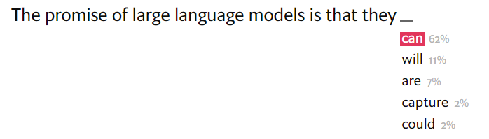
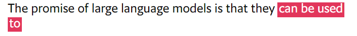
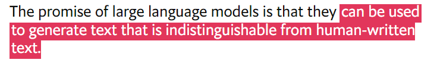
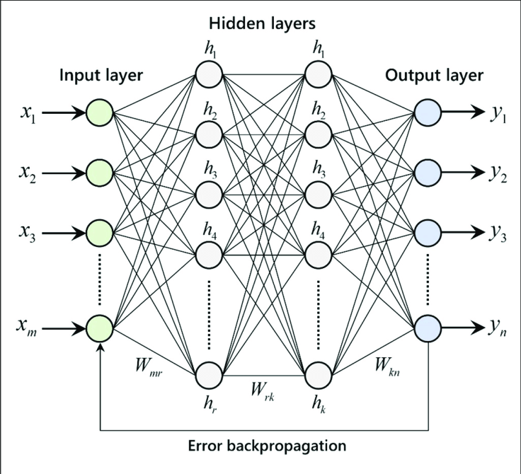
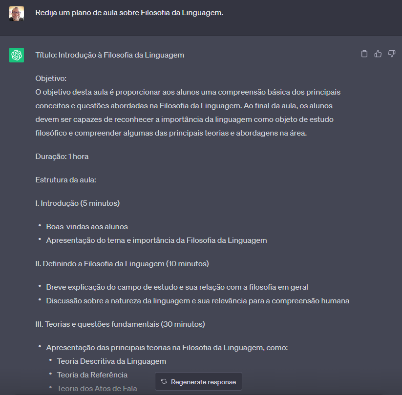
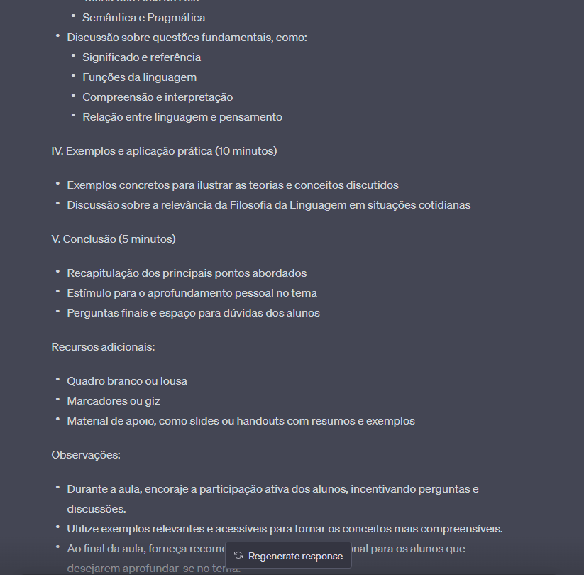
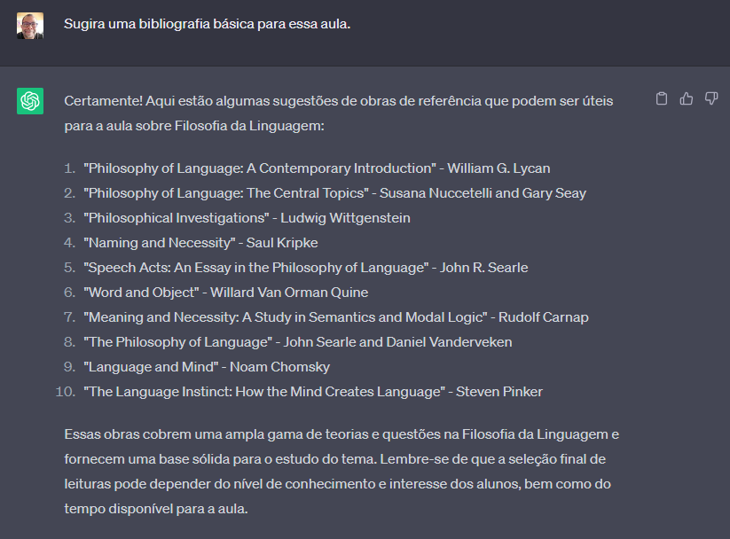

<!-- _class: titlepage -->

 Inteligência Artificial e o Chat-GPT

 Uma apresentação introdutória. 

 Paulo Roberto Martins Cunha                               

 15 de junho de 2023        

 GFT Talks - Grupo de Filosofia Temática (GFT)    

---

<!-- ---------------------------- -->

<!-- footer: GFT Talks: Inteligência Artificial e o GPT-3 -->

  

  
 

  

## **Paulo Roberto Martins Cunha**

- Engenheiro Eletricista - UFPA (1992);
- Bacharel em Direito - UFPA (2020);
- Bacharelando em Filosofia - UFPA.

#### Interesses:

- Ética, Idealismo alemão, Filosofia da tecnologia.

#### Contatos:

- e-mail: cunha.paulo@gmail.com;
- tel.: (91) 98111-5890 (WhatsApp).

---
<!-- ---------------------------- -->

# Agenda (**Desejada**)

1. **Raizes da ideia de uma inteligência artificial**

   1. Mitologia, literatura, teatro, cinema.

2. **O que é Inteligência Artificial?**

   1. O que é Computação?
   2. Métodos de implementação de Inteligência Artificial.

3. **O Sistema GPT-3**

   1. O que é inteligência artificial **generativa**?

4. **Problematizações**.

   1. **Ética** do uso **acadêmico** do GPT-3;
   2. A questão dos **empregos** humanos ameaçados pela IA.

---
<!-- ---------------------------- -->

<!-- _class: transition -->

Parte 1:   _Raízes da Ideia de uma  Inteligência Artificial_

---
<!-- ---------------------------- -->

<!-- _class: transition2 -->

_MITOLOGIA_

<!--  -->

<!--  -->

---
<!-- ---------------------------- -->

# Mitologia - **Grécia**

- _Talos_ - autômato criado por **Hefestos**, era um robô gigante de bronze presenteado por Zeus a Minos para guardar sua ilha.   
- _Pandora_ - criatura de **Hefestos** a mando de **Zeus**, com o concurso de todos os deuses, para vingança contra a humanidade após **Prometeu** ter dado o segredo do fogo ao homem. Sua **curiosidade** a fez abrir o **jarro** de todos os males.

- _Donzelas Douradas_ - também criadas por **Hefestos** como assistentes femininas, podiam antecipar e responder às necessidades de seu criador, com características humanas: **consciência**, **inteligência**, **aprendi-zado**, **razão** e **fala**.  A criação de máquinas inteligentes e automatizadas tem **motivação** de **economia de trabalho** humano.

---
<!-- ---------------------------- -->

<!-- _class: transition2 -->

<!--  -->

---
<!-- ---------------------------- -->

<!-- _class: transition2 -->

_LITERATURA_

<!--  -->
<!--  -->

---
<!-- ---------------------------- -->

# Literatura - **Golem** (Praga, `séc. XIV`)

- Associado à tradição mistica do judaísmo (**Cabala**);

- O Golem é um ser **artificial** (animado de matéria inanimada) e teria sido feito com a **argila** (silício) do rio Moldava que banha Praga, por um processo **divino** (programação);

- O **rabino** (programador) construiu o Golem e, seguindo **orações específicas** (programação), fez com que ele ganhasse **vida** (inteli-gência artificial);

---
<!-- ---------------------------- -->

# Literatura - **Golem**

- recitando um **hino especial** (programação) em **hebraico** (linguagem de programação) e escrevendo na sua testa a palavra **Emet** (_אמת_), que em hebraico significa **verdade**.   

- O Golem deveria **obedecer ao rabino** (programação ética), **ajudando** e **protegendo** (programação) o gueto judaico dos ataques anti-semitas;

---
<!-- ---------------------------- -->

# Literatura - **Golem**

- Porém, o Golem cresceu e se tornou **violento** e começou a **matar pessoas** espalhando o medo (erro de programação-treino).
- O rabino concordou em destruir o Golem _apagando a primeira letra da palavra_ **Emet** que formaria a palavra **Met** que significa **"morto"** em hebraico (mecanismo de segurança).

---
<!-- ---------------------------- -->

# Literatura - **Frankenstein** (`1818`)

- **Mary Shelley** - "Frankenstein ou o Prometeu Moderno"
- Considerada a primeira obra de Ficção Científica;
- Victor von **Frankenstein** era o criador, não a criatura;   
- Avaliação: 🌟🌟🌟🌟🌟

---
<!-- ---------------------------- -->

<!-- _class: transition2 -->

_TEATRO_

---
<!-- ---------------------------- -->

<!-- _backgroundColor: black -->

### <!--fit--> **R.U.R.** 
_`1920`_

##### Rossum's Universal Robots (Robôs Universais de Rossum) é uma peça teatral de ficção científica escrita pelo tcheco **`Karel Čapek`** - Praga, Tchecoslo-váquia.

<!-- _footer: . -->

---
<!-- ---------------------------- -->

<!-- _backgroundColor: black -->

#### <!--fit--> **R.U.R.**

<!-- #### fit **Rossum's Universal Robots** -->

### A palavra **`robô`**, do tcheco **`robota`** (trabalho forçado), foi mencionada pela primeira vez na peça. O nome **`Rossum`** é uma alusão à palavra checa **`rozum`**, que significa **`razão`**.

<!-- _footer: . -->

---

---
<!-- ---------------------------- -->

<!-- _backgroundColor: black -->

#### <!--fit--> **`Epílogo`**

<!-- #### fit **Rossum's Universal Robots** -->

### Resta apenas um último homem vivo com a tarefa, imposta pelos robôs, de de criar uma formula para aumentar seu tempo máximo de vida, que era de 20 anos.

<!-- _footer: . -->

---
<!-- ---------------------------- -->

<!-- _class: transition2 -->

_CINEMA_

<!--  -->
<!--  -->

---
<!-- ---------------------------- -->

<!-- _backgroundColor: black -->

## <!--fit--> **O Golem**

## <!--fit--> _`1920`_

>   Cena do filme "O Golem - Como veio ao mundo" (Der Golem, wie er in die Welt kam), do diretor Paul Wegener. Alemanha.

<!-- _footer: . -->

---
<!-- ---------------------------- -->

# Cinema - **Metropolis** (`1927`)

- A desumanização do ser humano pelas máquinas;   
- Avaliação: 🌟🌟🌟🌟🌟

---
<!-- ---------------------------- -->

# Cinema - **2001 Uma Odisseia no Espaço** (`1968`)

- HAL 9000;
- Quais os perigos de uma inteligência não humana tomando decisões autônomas?   
- Avaliação: 🌟🌟🌟🌟🌟

---
<!-- ---------------------------- -->

# Cinema - **Blade Runner** (`1982`)

- Philip K. Dick - Ridley Scott.
- **Replicantes**: organismos biológicos **artificiais**.
- Existe necessidade uma **ética** no trato com criaturas **artificiais**?  
- Avaliação: 🌟🌟🌟🌟🌟(🌟)

---
<!-- ---------------------------- -->

:strip_icc()/i.s3.glbimg.com/v1/AUTH_08fbf48bc0524877943fe86e43087e7a/internal_photos/bs/2023/l/K/2Pxe1pSECjAwAlac2AAg/o-exterminador-do-futuro.png>)

# Cinema - **O Exterminador do Futuro** (`1984`)

- A **Skynet** como metáfora dos riscos à **sobrevivência** da **humanidade** em presença de uma inteligência artifical **autônoma**.   
- Avaliação: 🌟🌟🌟

---
<!-- ---------------------------- -->
<!-- 1. Star Wars 2. AI 3. Eu ,Robô 4. Ex Machina -->

---
<!-- ---------------------------- -->

<!-- _class: transition -->

Parte 2:   _O que é Inteligência Artificial?_

---
<!-- ---------------------------- -->

# O que é computação?

- **Computar**, originalmente, significava **calcular**.

- **Computação** é a formalização do conceito que descreve a execução de etapas **finitas** para realização de um **cálculo**.
- **Calcular** é um processo passível de _mecanização_!  Ou seja, pode ser **automatizável** ou com o auxílio  de _máquinas_ <small> (mecânicas, eletrônicas, quanticas, etc.) </small>.

---
<!-- ---------------------------- -->

<!--  -->

---
<!-- ---------------------------- -->

<!-- _class: transition -->
<!-- _backgroundColor: gray -->

_Computação_ $\xRightarrow[\frac{aproximado}{similar}]{\frac{equivalente}{congruente}}$ _Inteligência_ ?

---
<!-- ---------------------------- -->

# Computação $\equiv$ Inteligência?

**Cálcular** refere-se à manipulação ordenada de **símbolos** em geral (números, letras, etc.), em uma **sequência finita** bem definida, em busca de um **resultado** esperado;

Exemplos:

- $7 + 5$

- $7\space 5\space +$
- $a + b$
- $\lambda x \lambda y \equiv_{\alpha} \space a+b$
- $00000111 \land 00000101$

---
<!-- ---------------------------- -->

# Computação $\equiv$ Inteligência?

**Cálcular** refere-se à manipulação ordenada de **símbolos** em geral (números, letras, etc.), em uma **sequência finita** bem definida, em busca de um **resultado** esperado;

_Calculando_:

- **$7 + 5$** $=12$

- **$7 \space 5\space +$** $\rightarrow 12$
- $r =$ **$a + b$**
- $(\lambda x \lambda y) \equiv$ **$x+y$**   $(\lambda x \lambda y) a b \equiv_{\alpha}$ **$a+b$**
- $00000111_{b}$   $00000101_{b}$ (and)  **$00001100_{b}$**

---
<!-- ---------------------------- -->

# Computação $\equiv$ Inteligência?

_PERGUNTA:_ A capacidade de realizar **cálculos** é uma definição do que seja **inteligência**?   

Exemplos:

- **$7 + 5$** $=12$

- **$7 \space 5 +$** $\rightarrow 12$
- $r =$ **$a + b$**
- $(\lambda x \lambda y) \equiv$ **$x+y$**   $(\lambda x \lambda y) a b \equiv_{\alpha}$ **$a+b$**
- $00000111_{b}$   $00000101_{b}$ (and)  **$00001100_{b}$**

---
<!-- ---------------------------- -->

# Computação $\equiv$ Inteligência?

- O **ato de calcular** em si **não** é necessariamente um **indicador** de inteligência.

- O cálculo é uma **habilidade específica**, também relacionada à matemática, que pode ser aprendido e **realizado** através de **métodos** e **algoritmos** pré-estabelecidos.

- No **homem**, o calcular é sim uma forma de pensar. Na **máquina** é a expressão do automatismo com que foi criada pela inteligência humana.

---
<!-- ---------------------------- -->

# Computação $\subsetneq$ Inteligência?

- **Cálculo** pode ser visto como uma **forma específica de pensamento** relacionada à **matemática**,
- É importante lembrar que o **pensamento humano** abrange uma **ampla gama** de **atividades cognitivas**, como: raciocínio lógico, resolução de problemas, tomada de decisões, criatividade, memória e compreensão.

- O cálculo é **apenas uma faceta** desse processo mais amplo de pensamento humano.

---
<!-- ---------------------------- -->

<!--  -->
<!--  -->

<!-- _color: white -->
<!-- footer: . -->

             

#### <!-- fit --> $Descartes \longmapsto  Leibniz \longmapsto   Turing \longmapsto   Chomsky$

---
<!-- ---------------------------- -->
<!-- _class: transition2 -->

_O que é Inteligência Artificial?_

---
<!-- ---------------------------- -->

<!--  -->

# O que é "Inteligência Artificial"?

A **"Inteligência Artificial"** é um ramo de pesquisas dentro da **computação**, cujo objetivo é criar **serviços**, **plataformas**, **programas** e **robôs** que possam **imitar**, se **igualar** ou **substituir** decisões e ações equivalente à **inteligência humana** (natural).

---
<!-- ---------------------------- -->

# Inteligência **Artificial**

1. habilidades **UMA por vez**

1. melhor em **AUTOMAÇÃO**

1. melhor em análise por **VOLUME**

1. processamento **VELOCIDADE**

1. natureza **RAZÃO**

# Inteligência **Humana**

1. habilidades **MÚLTIPLAS simultâneas**

1. melhor em **AUTONOMIA**

1. melhor em análise de **AMBIGUIDADES**

1. processamento **PENSAMENTO CRÍTICO**

1. natureza **EMOÇÃO**

---
<!-- ---------------------------- -->

# "Inteligência" Artificial

- O termo **inteligência** deve ser pensado como um **atributo** da **criatura** (computador) ou do seu **criador**?

- A **"Inteligência" Artificial** é uma imitação da **Inteligência Humana**.

- Faz parte dos processos humanos a **projeção** de sua humanidade em **seres** e **coisas**.

## As **máquinas** podem **pensar**?

---
<!-- ---------------------------- -->

<!-- _color: white -->
<!-- _color: orange -->
<!-- _color: lightgray -->
<!-- _color: yellow -->

### Já descrito como o "robô humanoide mais avançado do mundo",
### **Ameca** é uma criação da startup **Engineered Arts**.

---
<!-- ------------------------------------------------------------------------------- -->

---

<!-- ------------------------------------------------------------------------------- -->

---
<!-- ---------------------------- -->

---
<!-- ---------------------------- -->

---
<!-- ---------------------------- -->

---
<!-- ---------------------------- -->

---
<!-- ---------------------------- -->
<!-- _class: transition -->

_OpenAI GPT-3_

---
<!-- ---------------------------- -->

# OpenAI GPT-3

- **Público** em novembro de **2022**;

- GPT-3 incorpora mais conhecimento do que q**ualquer ser humano** jamais conheceu;

- Ele pode gerar **músicas**, **poemas** e **ensaios** sobre os mais diversos temas;

- Aprovado em exames para ingresso em carreiras de **direito** e **medicina** nos EUA.

- GPT-3 é um tipo de IA **generativo** chamado **modelo de linguagem ampla** (Large Language Model).

## _**$\blacktriangleleft$**_ GPT é Processamento de Linguagem Natural _**$\blacktriangleright$**_

---
<!-- ---------------------------- -->

# OpenAI GPT-3

- Capacidades atuais dessa AI iniciam em **2010** com as técnicas de **"Deep Learning"**;
- Derivam da disponibilidade de **colossais conjuntos de dados** e disponibilidade de **vasta capacidade computacional** via Unidades de Processamento Gráfico (**GPUs**);

- Melhorou a capacidade da IA de **reconhecer imagens**, **processar audio** e **aprender jogos**.
- Aberta ao público, o GPT-3 apresentou **melhorias assustadora** em **atividades** antes exclusivas do domínio da **inteligência humana**.
- Na verdade, **LLM** é um gigantesco **exercício de estatística**.

---
<!-- ---------------------------- -->

<!-- _class: transition2 -->

GPT-3

_Como funciona? (linhas gerais)_

---
<!-- ---------------------------- -->

# 1º passo: **Tokenização**

- Converte **PALAVRAS** em um **conjunto representativo** de **NÚMEROS** identificados e categorizadas como **TOKENS**;   
- **GPT-3** tem um dicionário de **50.257** tokens;
- O **GPT-3** processa no máximo **2.048** tokens por vez (pequeno artigo).
- **GPT-4** é capaz de processar   _32.000_ tokens (uma novela).

Uma **frase** escrita para que o **ChatGPT** a complete:

<strong>Ex.</strong>:

`The promise of large language models is that they _` 

será transformada em um conjunto de **números**.

---
<!-- ---------------------------- -->
<!-- _backgroundColor: white -->

# **Tokenização**

$$ \Downarrow $$

---
<!-- ---------------------------- -->

# 2º passo: **Contextualização**

- Os **TOKENS** recebem o equivalente a **DEFINIÇÕES**;

- São colocando-os em um **"espaço de significado"**;
- Palavras com **significados semelhantes** estão localizadas em áreas próximas.

---
<!-- ---------------------------- -->
<!-- _backgroundColor: white -->

# Contextualização

---
<!-- ---------------------------- -->
<!-- _backgroundColor: white -->

# Contextualização

---
<!-- ---------------------------- -->

# 3º passo: Aplicação da **“Attention Network”**

- A **rede de atenção** codifica lentamente a estrutura da linguagem que vê como números (chamados de "pesos");
   
- Um **ser humano** letrado realiza essa associação e compreende **"naturalmente"** a relação entre as palavras;

- O **LLM** precisa **aprender** essas associações durante sua **fase de treinamento**;
   
- São **bilhões** de interações de treinamento para **codificar** a **estrutura da linguagem** (_"weights"_) - na **rede neuronal**!

---
<!-- ---------------------------- -->
<!-- _backgroundColor: white -->

---
<!-- ---------------------------- -->
<!-- _backgroundColor: white -->

---
<!-- ---------------------------- -->
<!-- _backgroundColor: white -->

---
<!-- ---------------------------- -->
<!-- _backgroundColor: white -->

---
<!-- ---------------------------- -->
<!-- _backgroundColor: white -->

  
$$\vdots$$

---
<!-- ---------------------------- -->
<!-- _backgroundColor: white -->

---
<!-- ---------------------------- -->

- Embora seja possível escrever as **regras** de como eles funcionam, os **resultados** dos **LLMS** **não** são totalmente **previsíveis**;
- Os LLMs conseguem sínteses de maneiras que surpreendem até mesmo as pessoas que os criam.
- **Jason Wei**, pesquisador da Openai, contabilizou **137** das chamadas **habilidades "emergentes"** em uma variedade de LLMs diferentes.

---
<!-- ---------------------------- -->
<!-- _class: transition2 -->

Redes Neurais

_Uma Visão Geral_

---
<!-- ---------------------------- -->

<!-- _backgroundColor: white -->

## Modelo de um **neurônio orgânica** (natural)

---
<!-- ---------------------------- -->

<!-- _backgroundColor: white -->

## Modelo de um **neurônio orgânico** (natural)

---
<!-- ---------------------------- -->
<!-- _backgroundColor: black -->

## Nos **cérebro**, existem cerca de **100 bilhões** de neurônios **interconectados** entre si, formando uma espécie de **rede neuronal**.

---
<!-- ---------------------------- -->

---
<!-- ---------------------------- -->

---
<!-- ---------------------------- -->

---
<!-- ---------------------------- -->
<!-- _backgroundColor: white -->

<!-- (https://www.researchgate.net/publication/329216193/figure/fig3/AS:697582816870406@1543328112943/Architecture-of-multilayer-artificial-neural-network-with-error-backpropagation.png) -->

## Este é um **modelo abstrato** de uma **rede neuronal** que pode ser implementada por meio de um programa de **computador**.

---
<!-- ---------------------------- -->
<!-- _backgroundColor: white -->

# LLM$^1$ e Redes Neurais

- Um exemplo de **Rede Neural** (ou neuronal) como modelo baseado em **neurônios** e no **cérebro** humano.

- Esta rede prevê _chuva_ (probabilidade) com base _temperatura_ e _umidade_.

> 1. **Large Language Models**: modelos de redes neuronais baseados em "deep learning".

---
<!-- ---------------------------- -->
<!-- _backgroundColor: white -->

# LLM e Redes Neurais

Esta é a **rede** anterior, mais complexa e mais precisa em predizer a **probabilidade** de _chuva_

---
<!-- ---------------------------- -->

## 

<!-- ------------------------------------------------------------------------------- -->

#

---
<!-- ---------------------------- -->

<!-- _class: transition2 -->

Interações com o Chat-GP

_Limitações da v.3_

---
<!-- ---------------------------- -->

# 1. Algumas limitações

---
<!-- ---------------------------- -->

# 2. **Falta de conhecimento atualizado**

- ## Treinamento concluído em _setembro de 2021_. A base de conhecimento está atualizada até essa data.
- ## Não possui informações sobre _eventos recentes_ ou desenvolvimentos que ocorreram após esse período.

---
<!-- ---------------------------- -->

# 3. **Sensibilidade ao contexto**

- ## Embora consiga compreender o contexto em uma determinada conversa ou texto, às vezes _pode perder o contexto específico_ de uma pergunta anterior, o que pode levar a respostas incorretas ou fora de contexto.

---
<!-- ---------------------------- -->

# 4. **Propensão à oferecer respostas incorretas**

- ## Não possui capacidade de verificação ou validação externa. Portanto, pode gerar respostas que parecem plausíveis, mas que _podem não ser necessariamente precisas ou corretas._

---
<!-- ---------------------------- -->

# 5. **Dificuldades com perguntas amplas ou vagas**

- ## Quando as _perguntas são muito amplas, vagas ou mal formuladas_, o GPT-3 pode ter dificuldade em fornecer uma resposta útil. Perguntas mais específicas e bem definidas geralmente produzem resultados melhores.

---
<!-- ---------------------------- -->

# 6. **Risco de vieses e informações incorretas**

- ## O treinamento do GPT-3 é baseado em grandes conjuntos de dados da internet, o que _pode incluir informações enviesadas ou incorretas_.

- ## Embora tenham sido feitos esforços para minimizar esses problemas, eles ainda podem estar presentes nas respostas fornecidas.

---
<!-- ---------------------------- -->

<!-- _class: transition2 -->

Interações com o GPT-3

_Lógica_

---
<!-- ---------------------------- -->

# 1. Primeira Pergunta (_O que é modus ponens?_)

---
<!-- ---------------------------- -->

# 2. Pergunta sobre o tema (_resposta correta_)

---
<!-- ---------------------------- -->

# 3. Segunda pergunta (_resposta equivocada_)

---
<!-- ---------------------------- -->

# 4. Provocação (_pista sobre o que se quer_)

---
<!-- ---------------------------- -->

# 5. Novamente (_resposta correta_)

---

## <!-- fit --> 😂

# <!-- fit --> ¡Correcto,  pero no no mucho!

---
<!-- ---------------------------- -->

# 6. Terceira pergunta (Silogismo aristotélico)

---
<!-- ---------------------------- -->

<!-- _class: transition2 -->

Interações com o Chat-GP

_Artigos acadêmicos_

---
<!-- ---------------------------- -->

# 1. Artigos Acadêmicos

---
<!-- ---------------------------- -->

# 2. Artigos Acadêmicos

---
<!-- ---------------------------- -->

# 3. Artigos Acadêmicos

---
<!-- ---------------------------- -->

# 4. Artigos Acadêmicos

---
<!-- ---------------------------- -->

<!-- _class: transition2 -->

Interações com o GPT-3

_Ética_

---
<!-- ---------------------------- -->

# 1. Questões éticas - **viés** ("bias")

---
<!-- ---------------------------- -->

# 2. Questões éticas - **escolhas**

---
<!-- ---------------------------- -->

# 3. Questões éticas - **ética contextual**

---
<!-- ---------------------------- -->

# 4. Ética ou salvaguardas?

---
<!-- ---------------------------- -->

# 5. Questões éticas

---
<!-- ---------------------------- -->

<!-- _class: transition2 -->

Interações com o GPT-3

_Peças Profissionais_

---
<!-- ---------------------------- -->

# 1. **Advocacia**

- Peças processuais.

---
<!-- ---------------------------- -->

---
<!-- ---------------------------- -->

# 2. Educação

- Planos de aula.

---
<!-- ---------------------------- -->

---
<!-- ---------------------------- -->

# **Bibliografia** sugerida para esta aula

---
<!-- ---------------------------- -->

---
<!-- ---------------------------- -->

# **Bibliografia** em português

---
<!-- ---------------------------- -->

---
<!-- ---------------------------- -->

---
<!-- ---------------------------- -->

<!-- _class: transition -->

Para Pensar a Respeito

_O que pode dar errado?_

---
<!-- ---------------------------- -->
<!-- _backgroundColor: black -->
<!-- _color: white -->

**PROBLEMAS:**

- As máquinas terão direitos algum dia?
- As máquinas podem cometer crimes?
- Elas são imputáveis pelos resultados de suas ações?
- Quando as máquinas construirem outras máquinas, será reprodução?

---
<!-- ---------------------------- -->
<!-- _backgroundColor: black -->
<!-- _color: white -->

**PROBLEMAS:**

- Perda de postos de trabalho;
- Implicações legais do uso do Chat-GPT;
- Autonomia das IAs;
- O uso da IA para construir armas de destruição em massa;
- O uso da IA para hackear sistemas de defesa de países;
- Acesso público à IA.

---
<!-- ---------------------------- -->

## <!-- fit --> A **regulação** é a **solução** ?

---
<!-- ---------------------------- -->

# Salvaguardas - **Isaac Asimov**

- **Primeira Lei**: Um robô não pode causar mal a um ser humano ou, por inação, permitir que um ser humano sofra algum mal;
- **Segunda Lei**: Um robô deve obedecer às ordens dadas por seres humanos, exceto nos casos em que tais ordens entrem em conflito com a Primeira Lei;
- **Terceira Lei**: Um robô deve proteger sua própria existência, desde que tal proteção não entre em conflito com a Primeira ou a Segunda Lei.

---
<!-- ---------------------------- -->

<!-- backgroundColor: white -->

